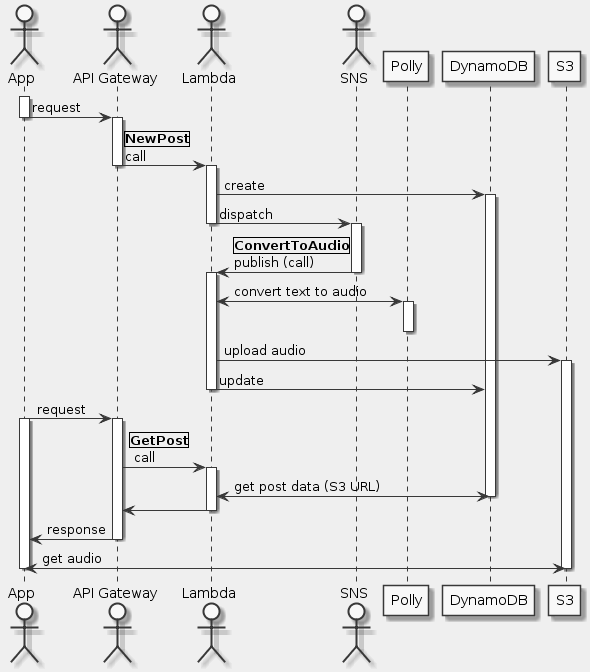

# Goal
- Create an Amazon DynamoDB to store data
- Create an Amazon API Gateway RESTful API
- Create AWS Lambda functions triggered by API Gateway
- Connect AWS Lambda functions with Amazon SNS
- Use Amazon Polly to synthesize speech in a variety of languages and voices

# Task
- [x] Create a DynamoDB Table
- [x] Create an Amazon S3 Bucket
- [x] Create an SNS Topic
- [x] Craete a New Post Lambda Function
- [x] Create a Convert to Audio Lambda Function
- [x] Test the functions
- [x] Create a Get Post Lambda Function
- [x] Expose the Lambda Function as RESTful Web Service
- [x] Create a Serverless Use Interface

# Supplement
## Sequence diagram

```uml
skinparam monochrome true
skinparam backgroundColor #EEEEFF

actor App as A
actor "API Gateway" as G
actor Lambda as L
actor SNS as N
participant Polly as P
participant DynamoDB as D
participant S3 as S

activate A
A -> G: request
deactivate A
activate G
G -> L: |NewPost|\ncall
deactivate G

activate L
L -> D: create
activate D
L -> N: dispatch
deactivate L
activate N
N -> L: |ConvertToAudio|\npublish (call)
deactivate N

activate L
L <-> P: convert text to audio
activate P
deactivate P
L -> S: upload audio
activate S
L -> D: update
deactivate L

A -> G: request
activate A
activate G
G -> L: |GetPost|\n call
activate L
L <-> D: get post data (S3 URL)
deactivate D
L -> G
deactivate L
G -> A: response
deactivate G

A <-> S: get audio
deactivate S
deactivate A
```

## Lambda
**IAM**
```json
{
  "Version": "2012-10-17",
  "Statement": [
    {
      "Action": [
        "polly:SynthesizeSpeech",
        "dynamodb:Query",
        "dynamodb:Scan",
        "dynamodb:PutItem",
        "dynamodb:UpdateItem",
        "logs:CreateLogGroup",
        "logs:CreateLogStream",
        "logs:PutLogEvents",
        "sns:Publish",
        "s3:PutObject",
        "s3:PutObjectAcl",
        "s3:GetBucketLocation"
      ],
      "Resource": [
        "*"
      ],
      "Effect": "Allow"
    }
  ]
}
```

### Function NewPost
```python
import boto3
import os
import uuid

def lambda_handler(event, context):
    recordId = str(uuid.uuid4())
    voice = event["voice"]
    text = event["text"]

    print('Generating new DynamoDB record, with ID: ' + recordId)
    print('Input Text: ' + text)
    print('Selected voice: ' + voice)
    # Creating new record in DynamoDB table
    dynamodb = boto3.resource('dynamodb')
    table = dynamodb.Table(os.environ['DB_TABLE_NAME'])
    table.put_item(
        Item={
            'id' : recordId,
            'text' : text,
            'voice' : voice,
            'status' : 'PROCESSING'
        }
    )
    # Sending notification about new post to SNS
    client = boto3.client('sns')
    client.publish(
        TopicArn = os.environ['SNS_TOPIC'],
        Message = recordId
    )
    return recordId
```

**Test**
```json
{
  "voice": "Joanna",
  "text": "This is working!"
}
```

### Function ConvertToAudio
```python
import boto3
import os
from contextlib import closing
from boto3.dynamodb.conditions import Key, Attr


def lambda_handler(event, context):
    postId = event["Records"][0]["Sns"]["Message"]

    print "Text to Speech function. Post ID in DynamoDB: " + postId

    # Retrieving information about the post from DynamoDB table
    dynamodb = boto3.resource('dynamodb')
    table = dynamodb.Table(os.environ['DB_TABLE_NAME'])
    postItem = table.query(
        KeyConditionExpression=Key('id').eq(postId)
    )


    text = postItem["Items"][0]["text"]
    voice = postItem["Items"][0]["voice"]

    rest = text

    # Because single invocation of the polly synthesize_speech api can
    # transform text with about 3000 characters, we are dividing the
    # post into blocks of approximately 2500 characters.
    textBlocks = []
    while (len(rest) > 2600):
        begin = 0
        end = rest.find(".", 2500)

        if (end == -1):
            end = rest.find(" ", 2500)

        textBlock = rest[begin:end]
        rest = rest[end:]
        textBlocks.append(textBlock)
    textBlocks.append(rest)

    # For each block, invoke Polly API, which will transform text into audio
    polly = boto3.client('polly')
    for textBlock in textBlocks:
        response = polly.synthesize_speech(
            OutputFormat='mp3',
            Text = textBlock,
            VoiceId = voice
        )

        # Save the audio stream returned by Amazon Polly on Lambda's temp
        # directory. If there are multiple text blocks, the audio stream
        # will be combined into a single file.
        if "AudioStream" in response:
            with closing(response["AudioStream"]) as stream:
                output = os.path.join("/tmp/", postId)
                with open(output, "a") as file:
                    file.write(stream.read())

    s3 = boto3.client('s3')
    s3.upload_file('/tmp/' + postId,
                   os.environ['BUCKET_NAME'],
      postId + ".mp3"   )
    s3.put_object_acl(ACL='public-read',
                      Bucket=os.environ['BUCKET_NAME'],
      Key= postId + ".mp3"   )

    location = s3.get_bucket_location(Bucket=os.environ['BUCKET_NAME'])
    region = location['LocationConstraint']

    if region is None:
        url_beginning = "https://s3.amazonaws.com/"
    else:
        url_beginning = "https://s3-" + str(region) + ".amazonaws.com/"

    url = url_beginning \
            + str(os.environ['BUCKET_NAME']) \
            + "/" \
            + str(postId) \
            + ".mp3"

    # Updating the item in DynamoDB
    response = table.update_item(
        Key={'id':postId},
          UpdateExpression=
            "SET #statusAtt = :statusValue, #urlAtt = :urlValue",
          ExpressionAttributeValues=
            {':statusValue': 'UPDATED', ':urlValue': url},
        ExpressionAttributeNames=
          {'#statusAtt': 'status', '#urlAtt': 'url'},
    )

    return
```

### Function GetPost
```python
import boto3
import os
from boto3.dynamodb.conditions import Key, Attr


def lambda_handler(event, context):
    postId = event["postId"]

    dynamodb = boto3.resource('dynamodb')
    table = dynamodb.Table(os.environ['DB_TABLE_NAME'])

    if postId=="*":
        items = table.scan()
    else:
        items = table.query(
            KeyConditionExpression=Key('id').eq(postId)
        )

    return items["Items"]
```

**Test**
```json
{
  "postId": "*"
}
```

## API Gateway
### GET
**Integration request -> Mapping template**
```json
{
  "postId": "$input.params('postId')"
}
```

**S3 bucket policy**
```json
{
  "Version": "2012-10-17",
  "Statement": [
    {
      "Sid": "PublicReadGetObject",
      "Effect": "Allow",
      "Principal": "*",
      "Action": [
        "s3:GetObject"
      ],
      "Resource": [
        "arn:aws:s3:::WWW-BUCKET/*"
      ]
    }
  ]
}
```
